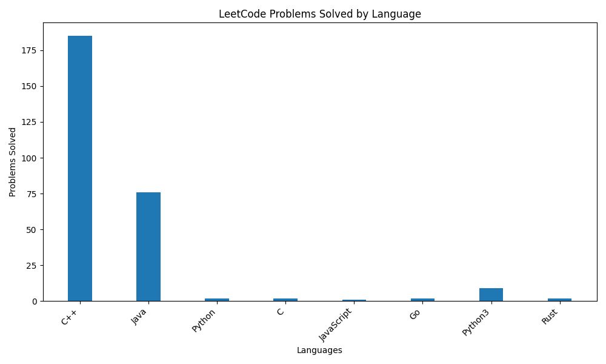

# My GitHub Profile

Hi! I am Vi Le. Welcome to my GitHub profile.

## LeetCode Statistics

<!-- LEETCODE_STATS_START -->
**LeetCode Stats**:

**User Profile Information:**
- Username: ViLeIUH185
- Total Problems Solved: 232
- Ranking: 465398
- Reputation: 0

**Problems Information:**
- Easy: 100/859
- Medium: 120/1799
- Hard: 12/802

**Coding Languages and Runtime Information:**
- C++: 160 problems
- Java: 76 problems
- Python: 2 problems
- C: 2 problems
- JavaScript: 1 problems
- Go: 1 problems
- Python3: 9 problems
- Rust: 2 problems

<!-- LEETCODE_STATS_END -->

## About Me
- 🌱 I’m currently learning Golang, Javascript, Python and Rust and web development.
- 💬 Ask me about programming and algorithms.
