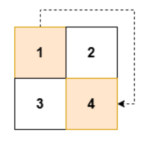
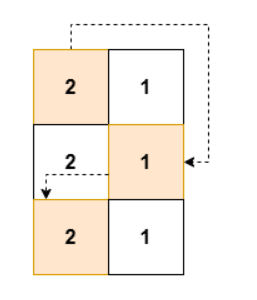
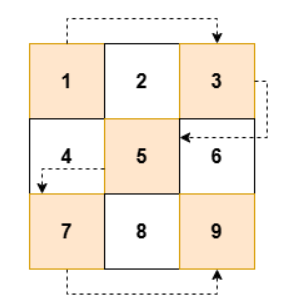

# Q1. Zigzag Grid Traversal With Skip

## Level: Easy

## Description

You are given an m x n 2D array grid of **positive** integers.

Your task is to traverse grid in a **zigzag** pattern while skipping every **alternate** cell.

Zigzag pattern traversal is defined as following the below actions:

- Start at the top-left cell (0, 0).
- Move right within a row until the end of the row is reached.
- Drop down to the next row, then traverse left until the beginning of the row is reached.
- Continue **alternating** between right and left traversal until every row has been traversed.
  **Note** that you **must skip** every alternate cell during the traversal.

Return an array of integers result containing, **in order**, the value of the cells visited during the zigzag traversal with skips.

**Example 1:**

- **Input:** grid = [[1,2],[3,4]]

- **Output:** [1,4]

- **Explanation:**

  

**Example 2:**

- **Input:** grid = [[2,1],[2,1],[2,1]]

- **Output:** [2,1,2]

- **Explanation:**

  

**Example 3:**

- **Input:** grid = [[1,2,3],[4,5,6],[7,8,9]]

- **Output:** [1,3,5,7,9]

- **Explanation:**

  

**Constraints:**

- 2 <= n == grid.length <= 50
- 2 <= m == grid[i].length <= 50
- 1 <= grid[i][j] <= 2500

## Understanding requirements
- I given the array 2D grid 
- I need to move zigzag pattern, get one and skip one
- Return the array 1D storage elements was got

## Solution 1: Brute Force
- Traversal for array 2D
- Have a variable only receive value is 0 and 1
- 0 is